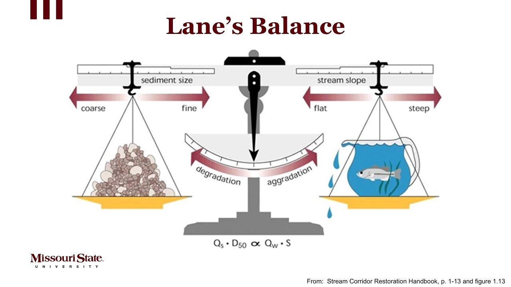

# Lane's Balance - Interactive Fluvial Geomorphology

An interactive web application demonstrating Lane's Balance, a fundamental principle in fluvial geomorphology that describes the relationship between sediment supply, grain size, water discharge, and channel slope in river systems.

## The Concept

*Lane's Balance: Qs · D50 ∝ Qw · S (Source: Stream Corridor Restoration Handbook, Figure 1.13)*

Lane's Balance states that a river's sediment load (Qs) multiplied by sediment size (D50) is proportional to water discharge (Qw) multiplied by slope (S). When these factors are balanced, the river is in equilibrium. Imbalance leads to:
- **Aggradation** (deposition) when sediment supply exceeds transport capacity
- **Degradation** (erosion) when transport capacity exceeds sediment supply

## Features

*   **Interactive Sliders:** Adjust the four key parameters of Lane's Balance (Qs, D50, Qw, S) and see the results in real-time.
*   **Balance Scale Visualization:** A visual metaphor of a balance scale that tilts to show the tendency towards aggradation or degradation.
*   **Plan View Visualization:** A schematic representation of the river's channel pattern (straight, meandering, or braided) that changes based on the input parameters.
*   **Active Processes Display:** A list of the geomorphic processes that are currently active in the river system.
*   **Screenshot Functionality:** Download a screenshot of the current state of the visualization.

## How to View on GitHub Pages

This project is designed to be hosted on GitHub Pages. To view the application, you will need to:

1.  **Enable GitHub Pages:** In your GitHub repository settings, under the "Pages" section, select the `main` branch and the `/docs` folder as the source.
2.  **Access the URL:** Once GitHub Pages is enabled, you will be provided with a URL where you can access the live application.

## Local Development

To run the application locally, simply open the `docs/index.html` file in your web browser.

## License

This project is licensed under the MIT License. See the [LICENSE](LICENSE) file for details.
